# Graph Monkey

Animation workflow toolkit for Blender's Graph Editor. Keyboard-driven keyframe editing and channel management.

[日本語ドキュメント](docs/USER_GUIDE_JA.md)

---

## Quick Start

### Keyboard Layout

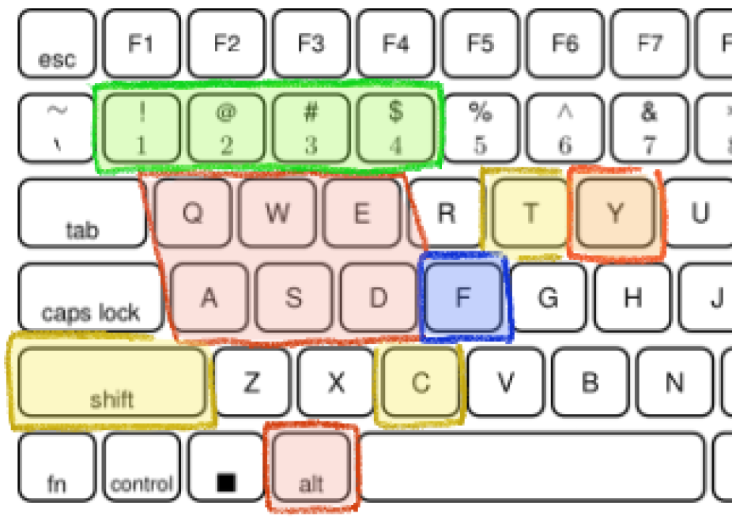

| Color | Key | Function |
|-------|-----|----------|
| 🔴 | `Alt + WASD/QE` | [Keyframe/Channel/Handle selection](#wasd-navigation) |
| 🟠 | `Y` (hold) | [Channel Navigator](#channel-navigator) |
| 🟢 | `1234` | [Frame jump](#frame-navigation--peek) (works in 3D View too) |
| 🔵 | `F` | [Focus on selected curve](#focus) |
| 🟡 | `Shift + T/C` | [Pie menus](#pie-menus) |

---

## WASD Navigation

Core feature for fast keyframe editing in Graph Editor. **Edit keyframes entirely from keyboard** without touching the mouse.

| Key | Action |
|-----|--------|
| `Alt + A` / `Alt + D` | Move to left/right keyframe |
| `Alt + W` / `Alt + S` | Move to upper/lower channel |
| `+ Shift` | Extend selection |

### Handle Selection

| Key | Action |
|-----|--------|
| `Alt + Q` / `Alt + E` | Select left/right handle |
| `+ Shift` | Extend selection |

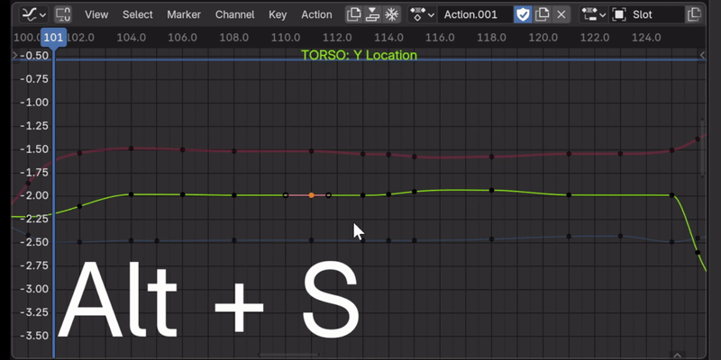

### Focus

| Key | Action |
|-----|--------|
| `F` | Focus on selected curve within playback range |
| `Alt + F` | Show entire selected curve |

### Auto Focus

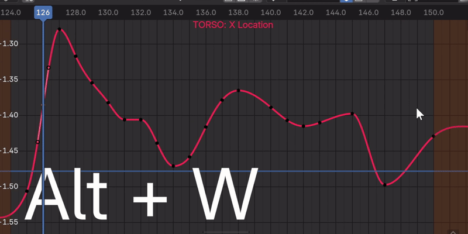

**Auto Focus on Channel Change**: Automatically focuses on the curve when switching channels with W/S.

**Auto Follow Current Frame**: Current frame follows when moving to a keyframe with A/D (single selection only).

---

## Channel Navigator

**Hold** the `Y` key to show an interactive channel management popup.

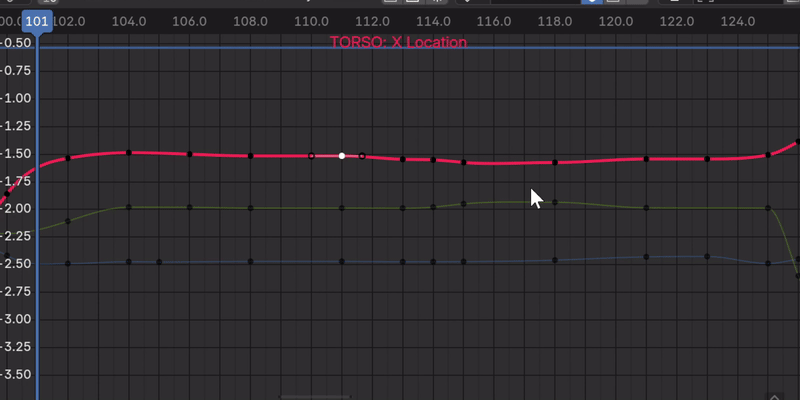

| Action | Function |
|--------|----------|
| Mouse hover | Switch channel selection |
| `Ctrl + Click` | Solo display |
| `H` / `L` / `M` | Toggle Hide / Lock / Mute |
| Mouse wheel | Scroll (when 8+ channels) |

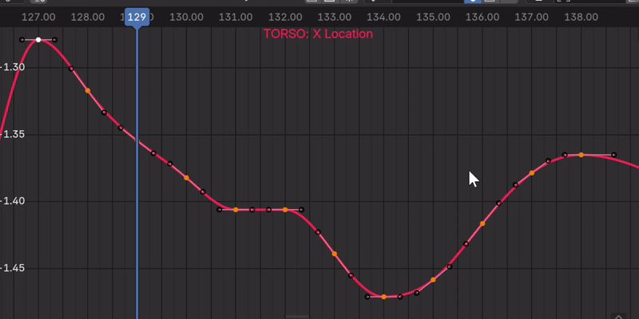

---

## Frame Navigation & Peek

Frame navigation that works from **any editor** - Timeline, Dopesheet, Graph Editor, or 3D View.

### Frame Jump

| Key | Action |
|-----|--------|
| `1` / `2` | Step back / forward 1 frame |
| `3` / `4` | Jump to previous / next keyframe |

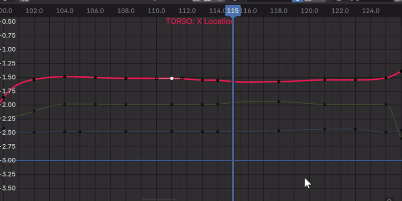

### Keyframe Type Filter

Filter by keyframe type (KEYFRAME, BREAKDOWN, EXTREME, etc.) in Timeline/Dopesheet header.

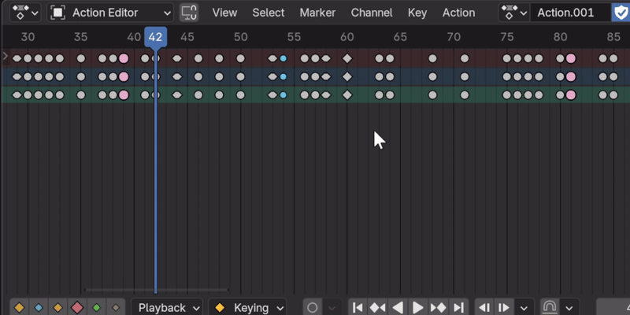

### Peek

`Shift + 3/4` **temporarily previews** adjacent keyframes. Quick pose comparison like flipping pages.

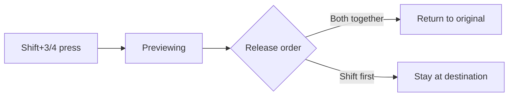

**During Peek**: `1`/`2` for additional offset, `Q` to reset

---

## Pie Menus

### Key Align Pie (Shift + T)

Align keyframes in Graph Editor.

| Item | Action |
|------|--------|
| Left / Right | Align on frame axis |
| Top / Bottom | Align on value axis |
| Flat | Flatten handles (weighted handles supported) |

### Transform Pie (Shift + C)

Quick access to Graph Editor transform settings.

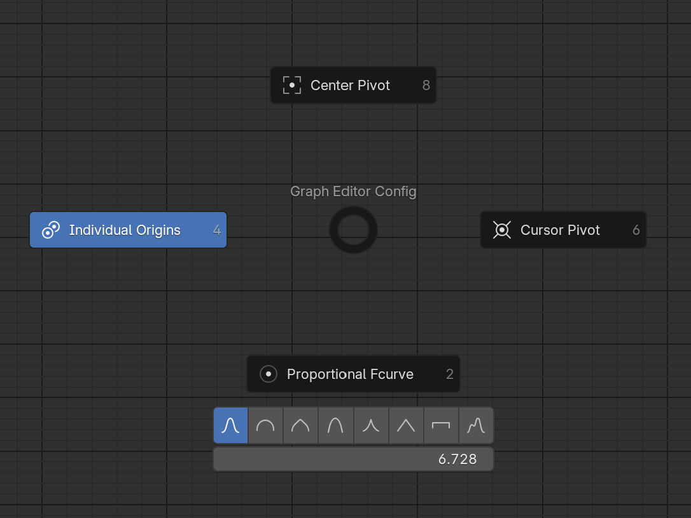

Toggle Pivot Point (Center / Individual / Cursor) and Proportional editing.

---

## UI Extensions

### Action Toolbar

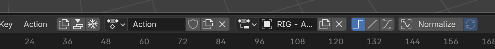

Action management buttons in Graph Editor header. Access Dopesheet Action Editor features directly.

### Interpolation Toggle

Icon buttons (CONSTANT / LINEAR / BEZIER) in Graph Editor header for quick interpolation type switching.

### F-Curves Panel

F-Curves settings in Graph Editor's N-panel (View tab). Change interpolation without opening Preferences.

### Playback Speed Controller

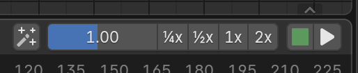

Speed control (0.01x - 9.0x) with preset buttons (¼x/½x/1x/2x). Click Store to save original range before adjusting.

### Channel Selection Overlay

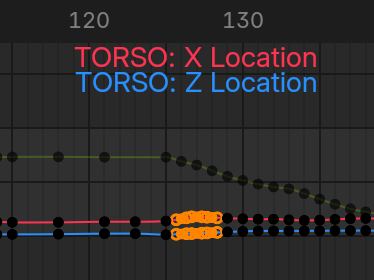

Shows selected F-Curve name on Graph Editor.

### Sync Visible Range

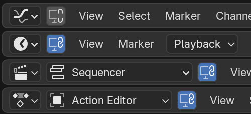

Lock visible range across time-based editors. Click the 🔒 icon in header. Scroll/zoom in one editor syncs others.

### Channel Expand/Collapse

| Key | Action |
|-----|--------|
| `Shift + A` | Expand all channels |
| `Ctrl + Shift + A` | Collapse all channels |

---

## Utilities

### Run Scripts

**File → Run Scripts** menu to execute Python scripts stored in blend files without opening Text Editor.

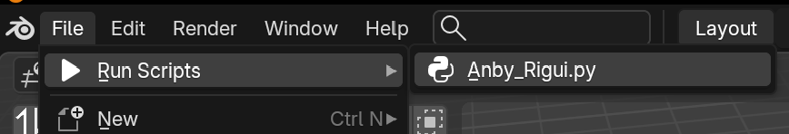

### Clean Animation Preview

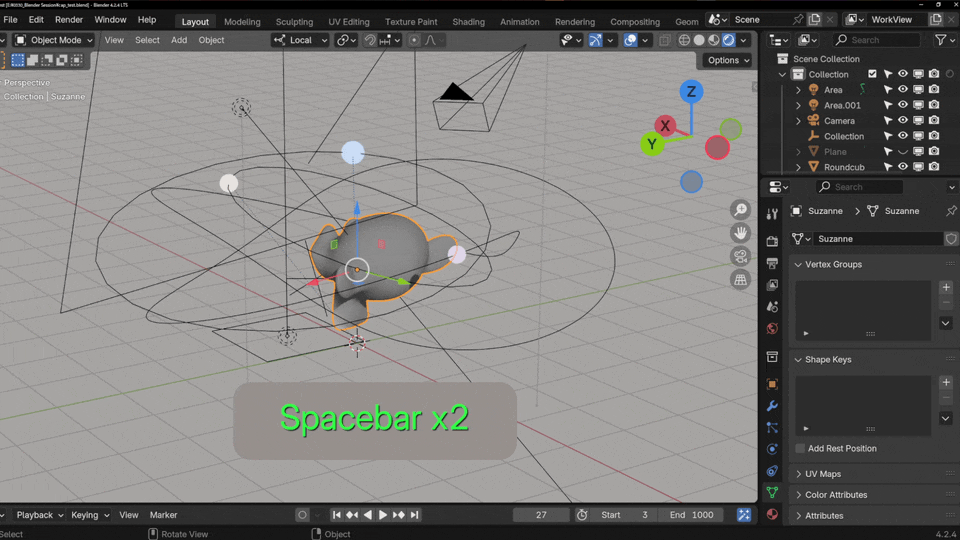

Hide bone names, axes, meshes etc. for clean animation preview.

---

## Pose Mode Tools

### Pose Transform Visualizer

Visualize bone rotation/translation in 3D View. Toggle with `V` key.

Arcs show rotation, arrows show translation. Color schemes: Heat / Cool / Grayscale.

### Bone Collection Solo

Solo the bone collection of selected bones (Blender 4.0+).

| Key | Action |
|-----|--------|
| `/` | Solo selected bone's collection |
| `Alt + /` | Unsolo |

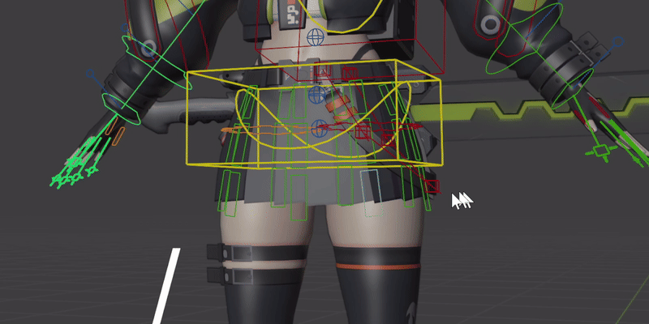

---

## Settings

**Edit → Preferences → Add-ons → Graph Monkey**

### Graph Editor

| Setting | Default | Description |
|---------|---------|-------------|
| Auto Focus on Channel Change | ON | Auto focus after channel move |
| Auto Follow Current Frame | OFF | Current frame follows keyframe selection |

### Channel Navigator

| Setting | Default | Description |
|---------|---------|-------------|
| Box Height / Width | 28 / 280 | Popup size |
| Text Size | 12 | Text size |
| Max Display Count | 8 | Max visible channels |

### Channel Overlay

| Setting | Default | Description |
|---------|---------|-------------|
| Font Size | 24 | Font size |
| Alignment | TOP_RIGHT | Display position |

### Pose Visualizer

| Setting | Default | Description |
|---------|---------|-------------|
| Show Rotation / Location | ON / ON | Visualize rotation/translation |
| Color Scheme | Heat | Heat / Cool / Grayscale |

---

## Installation

1. Download the [latest release](../../releases) zip
2. In Blender: Edit → Preferences → Add-ons → Install
3. Select the downloaded zip file
4. Enable "Graph Monkey"

## License

GPL-3.0 - See [LICENSE](LICENSE) for details.
