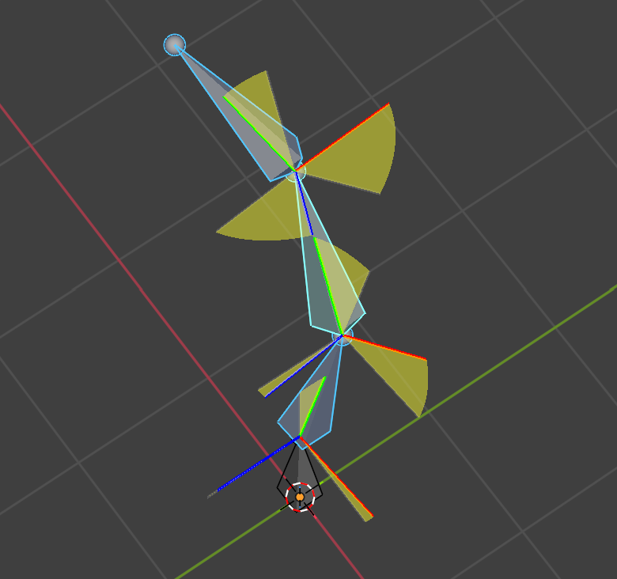

# Graph Monkey - Blender Animation Tools

Graph Monkey is a Blender addon that enhances the Graph Editor and animation workflow with powerful keyframe manipulation tools and interface improvements.

## Features

### 1. Keyframe Selection Navigation

Navigate and select keyframes intuitively with directional movement controls.

**Main Operations:**
- **Horizontal Movement**: Move keyframe selection left/right to adjacent keyframes
- **Vertical Movement**: Move channel selection up/down between F-curves
- **Handle Selection**: Toggle left/right Bezier handle selection

**Keybindings:**
- `Alt + A/D`: Move keyframe selection horizontally (backward/forward)
- `Alt + W/S`: Move channel selection vertically (upward/downward)  
- `Alt + Q/E`: Toggle left/right handle selection
- `Shift + Alt + [Key]`: Extend selection while moving

**Channel Selection Overlay:**
Real-time display of selected channel names with color coding in the viewport. Shows up to 3 channels with overflow summary.

### 2. Playback Speed Controller

Control animation playback speed without affecting keyframe timing, integrated into the Dopesheet header.

**Features:**
- Adjustable playback speed from 0.01x to 9.0x
- Speed presets: ¼x, ½x, 1x, 2x
- Original frame range preservation
- Visual status indicators for range state

**Controls:**
- Speed slider with real-time adjustment
- Preset buttons for common speeds
- Store button (saves original frame range)
- Reset button (returns to 1x speed)

### 3. Graph Editor Action Management

Manage actions directly from the Graph Editor without switching to Dopesheet/Action Editor.

**Available Operations:**
- Create new action
- Unlink current action
- Push down to NLA stack
- Stash in NLA stack
- Move channels to new action (Blender 4.4+)
- Navigate between action layers

**Location**: Graph Editor header with dedicated buttons and action selector template.

### 4. Enhanced Keyframe Navigation

Left-hand optimized keyframe jumping with number keys 1-4, supporting frame range looping.

**Keybindings:**
- `1/2`: Frame-by-frame movement (backward/forward)
- `3/4`: Keyframe jumping with range looping (backward/forward)
- `Shift + 3/4`: Keyframe peeking (preview next/previous, return on release)
- `Ctrl + Shift + 3/4`: Stay at peeked frame

**Features:**
- Automatic looping within frame/preview range
- Context-aware keyframe detection
- Modal peek operation with visual feedback

### 5. View Selected Curves Range

Smart viewport focusing for selected curves within the current frame range.

**Operation:**
- `F`: Focus on selected curves within frame range
- `Alt + F`: View all curves (built-in)

**Features:**
- Respects frame/preview range boundaries
- Preserves original keyframe selection
- Optional handle inclusion in focus calculation

### 6. Pose Rotation Visualizer 🆕

Real-time visualization of bone rotations in Pose Mode. Displays rest pose axes and current pose axes with rotation arcs in the 3D viewport.

**Features:**
- **Axis Display**: Shows rest pose (semi-transparent gray) and current pose (X=red, Y=green, Z=blue) axes
- **Rotation Arcs**: Visualizes rotation amount with customizable colored arcs
- **Local Transform**: Displays only the bone's own rotation, excluding parent influence
- **Customizable Colors**: Individual color settings for X, Y, Z rotation arcs
- **Angle Threshold**: Filter display by minimum rotation angle
- **Draw on Top**: Optional overlay to ensure visibility

**Settings** (Edit > Preferences > Add-ons > Graph Monkey > Pose Visualizer):
- Enable/Disable visualization
- Display style: Both / Axes Only / Difference Only
- Axis length and thickness
- Arc radius, segments, and opacity
- Custom arc colors per axis
- Draw on top option

## Requirements

- Blender 3.6+
- Some features require Blender 4.4+ (action layers)

## Installation

1. Download the addon
2. Install via Blender Preferences > Add-ons > Install
3. Enable "Graph Monkey" addon
4. Keymaps are automatically registered

## Usage Context

All features are primarily designed for the **Graph Editor** workspace, with some functionality extending to Dopesheet and Timeline editors. The addon focuses on improving animation workflow efficiency through intuitive keyframe manipulation and reduced context switching between editors.
