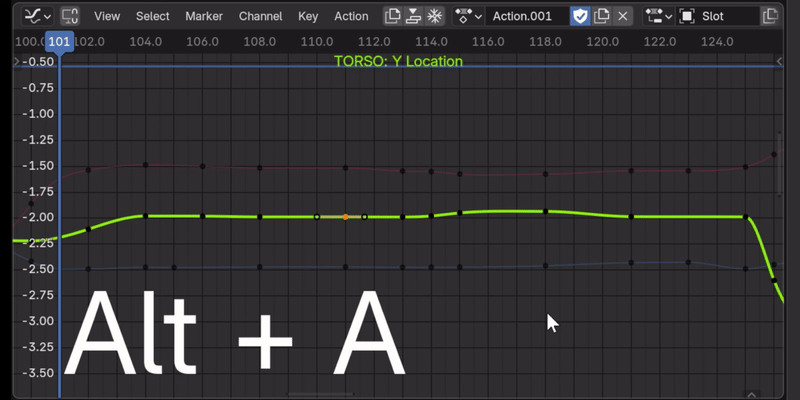
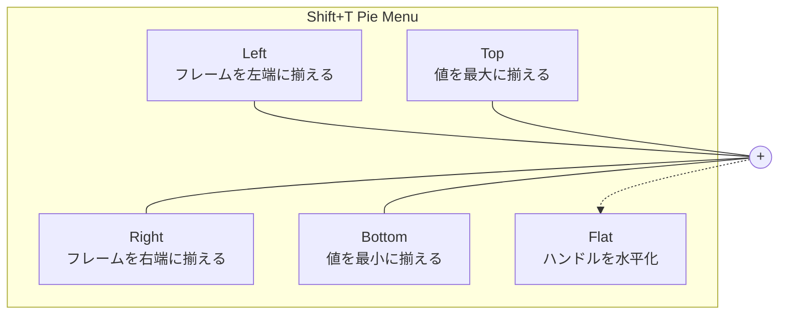
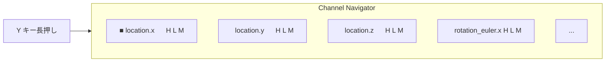
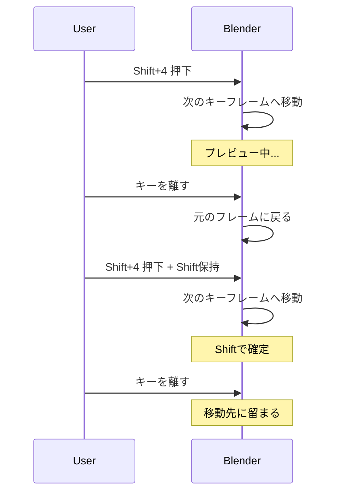
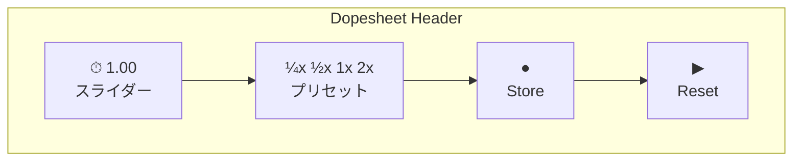
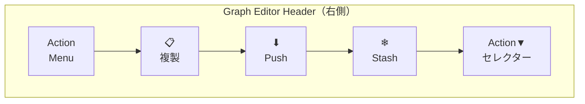
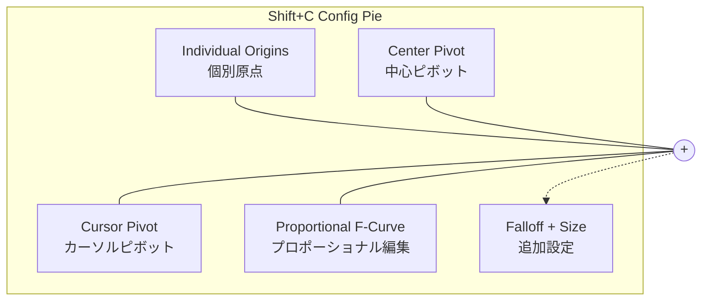
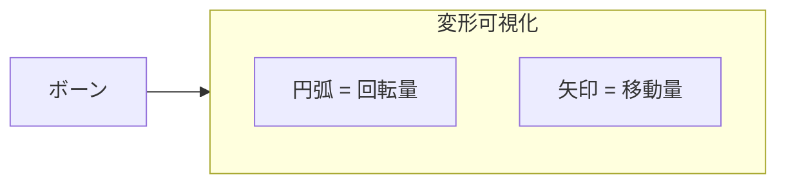

# MonKey (Graph Monkey) ユーザーガイド

**バージョン**: 0.9.0
**対応Blender**: 2.80以降（一部機能は4.4以降）

---

## 目次

1. [はじめに](#はじめに)
2. [ワークフロー別ガイド](#ワークフロー別ガイド)
   - [Graph Editor キーフレーム編集](#1-graph-editor-キーフレーム編集)
   - [チャンネル管理](#2-チャンネル管理)
   - [タイムライン操作](#3-タイムライン操作)
   - [Action管理](#4-action管理)
   - [エディタ設定・表示制御](#5-エディタ設定表示制御)
   - [ポーズモード支援](#6-ポーズモード支援)
3. [キーバインド一覧](#キーバインド一覧)
4. [設定項目リファレンス](#設定項目リファレンス)

---

## はじめに

MonKey（Graph Monkey）は、Blenderのアニメーション作業を効率化するアドオンです。特にGraph Editorでの作業を中心に、**キーボード操作だけで素早くキーフレームを編集**できるワークフローを提供します。

### MonKeyの動作デモ

**Alt + WASD** で、キーフレーム間・チャンネル間を自由自在に移動できます。マウスを使わず、キーボードだけで完結する直感的なワークフローを実現します。

### コンセプト：キーボード中心のワークフロー

**カラーコード**:
- 🔴 **赤**: Alt + WASD + QE（Graph Editor - キーフレーム/チャンネル/ハンドル選択）
- 🟠 **オレンジ**: Y長押し（Channel Navigator）
- 🟢 **緑**: 1234（フレーム移動 - 全エディタ共通）
- 🔵 **青**: F（Focus - 選択カーブにフォーカス）
- 🟡 **黄色**: Shift+T/C（Pieメニュー）

赤色の操作に **Shift** を追加すると拡張選択になります。

### 主な機能カテゴリ

| カテゴリ | 概要 |
|---------|------|
| **キーフレーム選択** | 隣接キーフレームへの移動、ハンドル選択 |
| **チャンネル管理** | F-Curveの切り替え、可視化、ナビゲーター |
| **タイムライン操作** | 範囲内ジャンプ、先読み（Peek）、再生速度制御 |
| **Action管理** | Graph EditorからのAction操作 |
| **エディタ設定** | Pivot Point、Proportional Edit、表示範囲同期 |
| **ポーズ支援** | ボーン回転可視化、コレクションソロ |

---

## ワークフロー別ガイド

### 1. Graph Editor キーフレーム編集

Graph Editorでのキーフレーム編集を高速化する機能群です。

#### 1-1. キーフレーム間移動（水平方向）

選択中のキーフレームから、同じF-Curve上の隣接キーフレームへ移動します。

| 操作 | キー | 説明 |
|------|------|------|
| 右へ移動 | `Alt + D` | 次のキーフレームを選択 |
| 右へ拡張 | `Alt + Shift + D` | 次のキーを選択に追加 |
| 左へ移動 | `Alt + A` | 前のキーフレームを選択 |
| 左へ拡張 | `Alt + Shift + A` | 前のキーを選択に追加 |

**設定オプション**: 「Auto Follow Current Frame」を有効にすると、単一キーフレーム選択時に現在フレームが自動追従します。

#### 1-2. ハンドル選択

キーフレームのベジェハンドル（制御点）を素早く選択します。

| 操作 | キー | 説明 |
|------|------|------|
| 左ハンドル | `Alt + Q` | 左側ハンドルを選択 |
| 左ハンドル拡張 | `Alt + Shift + Q` | 左ハンドルを選択に追加 |
| 右ハンドル | `Alt + E` | 右側ハンドルを選択 |
| 右ハンドル拡張 | `Alt + Shift + E` | 右ハンドルを選択に追加 |

#### 1-3. チャンネル間移動（垂直方向）

表示中のF-Curve（チャンネル）間を移動します。

| 操作 | キー | 説明 |
|------|------|------|
| 上へ移動 | `Alt + W` | 上のチャンネルを選択 |
| 上へ拡張 | `Alt + Shift + W` | 上のチャンネルを選択に追加 |
| 下へ移動 | `Alt + S` | 下のチャンネルを選択 |
| 下へ拡張 | `Alt + Shift + S` | 下のチャンネルを選択に追加 |

**設定オプション**: 「Auto Focus on Channel Change」が有効だと、チャンネル移動後に選択カーブが自動フォーカスされます。

#### 1-4. キーフレーム整列（Pie Menu）

`Shift + T` でキーフレーム整列用のPieメニューを表示します。

#### 1-5. フラット接線（Flat Tangents）

選択したハンドルを水平に平坦化します。**ウェイト付きタンジェントにも対応**し、元の長さを保持したまま角度のみを変更します。

- **Pieメニューから**: `Shift + T` → Flat (Free Handle)
- **直接実行**: オペレーター `anim.flat_tangents`

#### 1-6. 選択カーブのフォーカス

| 操作 | キー | 説明 |
|------|------|------|
| 範囲内フォーカス | `F` | 再生範囲内で選択カーブにフォーカス |
| 全体表示 | `Alt + F` | 選択カーブ全体を表示 |

---

### 2. チャンネル管理

複数のF-Curveを効率的に管理する機能です。

#### 2-1. Channel Navigator（チャンネルナビゲーター）

`Y`キーを**長押し**すると、インタラクティブなチャンネル管理ポップアップが表示されます。

**操作方法**:
| 操作 | 動作 |
|------|------|
| マウスオーバー | チャンネル選択を切り替え |
| Ctrl + クリック | ソロ表示（他のチャンネルを非表示） |
| H キー | Hide（非表示）トグル |
| L キー | Lock（ロック）トグル |
| M キー | Mute（ミュート）トグル |
| スクロール | 長いリストをスクロール |

**Auto Focus 機能**: Graph Editorの「Auto Focus on Channel Change」設定が有効な場合、チャンネルを切り替えると自動的に選択カーブにフォーカスします。

この機能により、複数のチャンネル間を素早く移動しながら、それぞれのカーブ全体を確認できます。

**設定可能項目**: ボックスの高さ・幅、テキストサイズ、最大表示数、背景透明度

#### 2-2. Channel Selection Overlay（チャンネル名オーバーレイ）

選択中のF-Curve名をGraph Editor上に常時表示します。

**トグル**: `graph.toggle_channel_selection_overlay`

**設定可能項目**: 表示ON/OFF、フォントサイズ（10-50）、テキスト色（RGBA）、表示位置（9箇所）、オフセット値、最大表示数

#### 2-3. チャンネル展開/折りたたみ

Animation Channelsパネルのチャンネルを一括操作します。

| 操作 | キー | 説明 |
|------|------|------|
| 全展開 | `Shift + A` | すべてのチャンネルを展開 |
| 全折りたたみ | `Ctrl + Shift + A` | すべてのチャンネルを折りたたみ |

---

### 3. タイムライン操作

Timeline、Dopesheet、Graph Editor共通で使えるフレーム移動・再生制御機能です。

#### 3-1. フレーム範囲内ジャンプ

再生範囲内でキーフレーム間をジャンプします。

| 操作 | キー | 説明 |
|------|------|------|
| 1フレーム戻る | `1` | 現在フレーム -1 |
| 1フレーム進む | `2` | 現在フレーム +1 |
| 前のキーフレーム | `3` | 前のキーフレームへジャンプ |
| 次のキーフレーム | `4` | 次のキーフレームへジャンプ |

**キーフレームタイプフィルター**:

Timeline/Dopesheetヘッダーに表示されるフィルターで、**特定のキーフレームタイプのみをジャンプ対象**にできます。複数のタイプを同時に選択可能です。

対応タイプ：
- KEYFRAME（通常キー）
- BREAKDOWN（ブレイクダウン）
- MOVING_HOLD
- EXTREME
- JITTER

例えば、KEYFRAME と BREAKDOWN のみを選択すれば、他のタイプ（EXTREME等）は`3`/`4`キーでスキップされます。

#### 3-2. キーフレーム先読み（Peek）

キーを押している間だけ、隣のキーフレームを**プレビュー**します。キーを離すと元のフレームに戻ります。

| 操作 | キー | 説明 |
|------|------|------|
| 前キーを先読み | `Shift + 3` | 前のキーフレームを一時表示 |
| 次キーを先読み | `Shift + 4` | 次のキーフレームを一時表示 |

**Peek中の追加操作**:
- `Shift`キーを押し続ける → 移動先に留まる（元に戻らない）
- `1` / `2` キー → 追加フレームオフセット
- `Q` キー → リセット

#### 3-3. Playback Speed Controller（再生速度コントローラー）

Dopesheet/Timelineのヘッダーに**再生速度コントロール**が追加されます。

**UI要素**:
| 要素 | 説明 |
|------|------|
| スライダー | 0.01x〜9.0x の速度調整 |
| プリセットボタン | ¼x / ½x / 1x / 2x のワンクリック設定 |
| Storeボタン | オリジナルのフレーム範囲を保存（●で状態表示） |
| Resetボタン | 速度を1.0xに戻す |

**Storeボタンの色**:
| 色 | 状態 |
|----|------|
| 🟢 緑 | オリジナル範囲保存済み・問題なし |
| 🔴 赤 | 保存が必要 / 更新が必要 |
| 🔵 青 | オリジナル範囲を利用中（速度変更中） |

**動作原理**: Blenderの `frame_map_old` / `frame_map_new` を使用してタイムリマップを行います。速度変更時にフレーム範囲も自動調整されます。

---

### 4. Action管理

Graph EditorからAction操作を直接行える機能です。

#### 4-1. Graph Editor Action ツールバー

Graph Editorのヘッダーに**Action管理ボタン群**が追加されます。

**ボタン機能**:
| ボタン | 説明 |
|--------|------|
| Action Menu | Dopesheetと同じActionメニュー（4.4+） |
| 📋 (Duplicate) | 選択チャンネルを新Actionに移動（4.4+） |
| ⬇ (Push Down) | ActionをNLA Stackにプッシュダウン |
| ❄ (Stash) | ActionをNLA Stackにスタッシュ |

**Action セレクター**:
- 右側にActionドロップダウンが追加
- New / Unlink ボタン
- **4.4+**: Action Slot セレクターも表示

---

### 5. エディタ設定・表示制御

Graph Editorの設定を素早く変更するための機能です。

#### 5-1. Graph Editor Config Pie（設定Pieメニュー）

`Shift + C` で設定用Pieメニューを表示します。

**項目**:
| 位置 | 機能 |
|------|------|
| TOP | Center Pivot（中心ピボット） |
| LEFT | Individual Origins（個別原点） |
| RIGHT | Cursor Pivot（カーソルピボット） |
| BOTTOM | Proportional F-Curve（プロポーショナル編集） |
| 下部 | Falloff タイプ選択 + サイズスライダー |

#### 5-2. Sync Visible Range（表示範囲同期）

複数のタイムベースエディタ間で**表示範囲をロック**します。

**対応エディタ**:
- Dopesheet
- Graph Editor
- NLA Editor
- Video Sequencer
- Timeline（Blender 5.0未満）

**使い方**: ヘッダー左端の🔒アイコンをクリックしてロック/解除。ロック中は、あるエディタでスクロール/ズームすると他のエディタも連動します。

---

### 6. ポーズモード支援

3D Viewのポーズ編集を支援する機能です。

#### 6-1. Pose Transform Visualizer（ポーズ変形可視化）

ボーンの回転量・移動量を3Dビュー上に視覚的に表示します。

**カラースキーム**:
| スキーム | 説明 |
|----------|------|
| Heat | 変化量が大きいほど赤く |
| Cool | 変化量が大きいほど青く |
| Grayscale | モノクロ表示 |

**トグル**: `pose.toggle_transform_visualizer`

**設定可能項目**: 回転/移動表示ON/OFF、スケール、カラースキーム、透明度、線幅

#### 6-2. Bone Collection Solo（ボーンコレクションソロ）

選択中のボーンが属するBone Collectionをソロ表示します。**Blender 4.0以降対応**。

| 操作 | キー | 説明 |
|------|------|------|
| ソロ表示 | `/` | 選択ボーンのコレクションのみ表示 |
| ソロ解除 | `Alt + /` | すべてのソロ状態をクリア |

**オプション**: 既存ソロに追加、同じコレクションならトグル、ターゲットを必ず可視化

---

## キーバインド一覧

### Graph Editor

| キー | 修飾キー | 機能 |
|------|----------|------|
| `D` | Alt | 右キーフレームへ移動 |
| `D` | Alt + Shift | 右キーフレームへ拡張選択 |
| `A` | Alt | 左キーフレームへ移動 |
| `A` | Alt + Shift | 左キーフレームへ拡張選択 |
| `W` | Alt | 上チャンネルへ移動 |
| `W` | Alt + Shift | 上チャンネルへ拡張選択 |
| `S` | Alt | 下チャンネルへ移動 |
| `S` | Alt + Shift | 下チャンネルへ拡張選択 |
| `Q` | Alt | 左ハンドル選択 |
| `Q` | Alt + Shift | 左ハンドル拡張選択 |
| `E` | Alt | 右ハンドル選択 |
| `E` | Alt + Shift | 右ハンドル拡張選択 |
| `Y` | (長押し) | Channel Navigator表示 |
| `F` | - | 選択カーブをフォーカス（範囲内） |
| `F` | Alt | 選択カーブ全体表示 |
| `T` | Shift | キー整列Pieメニュー |
| `C` | Shift | エディタ設定Pieメニュー |

### Animation Channels（Graph Editor, Dopesheet）

| キー | 修飾キー | 機能 |
|------|----------|------|
| `A` | Shift | 全チャンネル展開 |
| `A` | Ctrl + Shift | 全チャンネル折りたたみ |

### Timeline / Dopesheet / 3D View

| キー | 修飾キー | 機能 |
|------|----------|------|
| `1` | - | 1フレーム戻る |
| `2` | - | 1フレーム進む |
| `3` | - | 前のキーフレームへジャンプ |
| `4` | - | 次のキーフレームへジャンプ |
| `3` | Shift | 前のキーフレームを先読み |
| `4` | Shift | 次のキーフレームを先読み |

### Pose Mode

| キー | 修飾キー | 機能 |
|------|----------|------|
| `/` | - | 選択ボーンのコレクションをソロ |
| `/` | Alt | ソロ解除 |

---

## 設定項目リファレンス

アドオンの設定は **Edit → Preferences → Add-ons → MonKey** で変更できます。

### Graph Editor タブ

| 項目 | デフォルト | 説明 |
|------|-----------|------|
| Auto Focus on Channel Change | ON | チャンネル移動後に自動フォーカス |
| Auto Follow Current Frame | OFF | キーフレーム選択時に現在フレーム追従 |

### Channel Navigator タブ

| 項目 | デフォルト | 範囲 | 説明 |
|------|-----------|------|------|
| Box Height | 28 | 20-60 | チャンネルボックスの高さ（px） |
| Box Width | 280 | 150-500 | ポップアップ幅（px） |
| Text Size | 12 | 8-24 | テキストサイズ |
| Max Display Count | 8 | 3-30 | 最大表示チャンネル数 |
| Background Alpha | 0.96 | 0.3-1.0 | 背景透明度 |

### Overlay タブ（Channel Selection Overlay）

| 項目 | デフォルト | 範囲 | 説明 |
|------|-----------|------|------|
| Show Text | ON | - | オーバーレイ表示 |
| Font Size | 24 | 10-50 | フォントサイズ |
| Color | 白 | RGBA | テキスト色 |
| Alignment | TOP_RIGHT | 9箇所 | 表示位置 |
| Offset X | 10 | 0- | 横オフセット |
| Offset Y | 50 | 0- | 縦オフセット |
| Max Display Count | 3 | 1-10 | 最大表示カーブ数 |

### Pose Visualizer タブ

| 項目 | デフォルト | 範囲 | 説明 |
|------|-----------|------|------|
| Show Rotation | ON | - | 回転可視化 |
| Show Location | ON | - | 移動可視化 |
| Rotation Scale | 0.3 | 0.1-2.0 | 回転円弧サイズ |
| Location Scale | 1.0 | 0.1-5.0 | 移動矢印サイズ |
| Color Scheme | Heat | Heat/Cool/Grayscale | カラースキーム |
| Alpha | 0.8 | 0.0-1.0 | 透明度 |
| Line Width | 2.0 | 0.5-5.0 | 線幅 |

---

## トラブルシューティング

### Q: キーバインドが動作しない

1. **Preferences → Keymap** タブで、該当のキーマップが有効か確認
2. 他のアドオンとキーが競合していないか確認
3. Graph Editorなど、正しいエディタで操作しているか確認

### Q: Channel Navigatorが表示されない

- `Y`キーは**長押し**で動作します。タップではなく押し続けてください

### Q: 再生速度を変更したらフレーム範囲がおかしくなった

1. 速度を1.0xにリセット
2. Storeボタン（●）をクリックしてオリジナル範囲を保存
3. その後、速度を変更してください

### Q: Graph EditorにActionセレクターが表示されない

- アクティブなオブジェクトが選択されているか確認
- オブジェクトにAnimation Dataが存在するか確認

---

## 機能対応エディタ一覧

| 機能 | Graph Editor | Dopesheet | Timeline | 3D View | NLA |
|------|:---:|:---:|:---:|:---:|:---:|
| キーフレーム選択（水平/垂直） | ✓ | - | - | - | - |
| ハンドル選択 | ✓ | - | - | - | - |
| Channel Navigator | ✓ | - | - | - | - |
| Channel Overlay | ✓ | - | - | - | - |
| キー整列Pie | ✓ | - | - | - | - |
| 設定Pie | ✓ | - | - | - | - |
| Flat Tangents | ✓ | ✓ | - | - | - |
| チャンネル展開/折りたたみ | ✓ | ✓ | - | - | - |
| フレームジャンプ | ✓ | ✓ | ✓ | ✓ | - |
| Peek（先読み） | ✓ | ✓ | ✓ | ✓ | - |
| 再生速度コントローラー | - | ✓ | ✓ | - | - |
| Action管理ツール | ✓ | - | - | - | - |
| 表示範囲ロック | ✓ | ✓ | ✓* | - | ✓ |
| Bone Collection Solo | - | - | - | ✓ | - |
| Pose Visualizer | - | - | - | ✓ | - |

*Timeline: Blender 5.0未満のみ

---

*MonKey - Graph Editorをもっと快適に*

