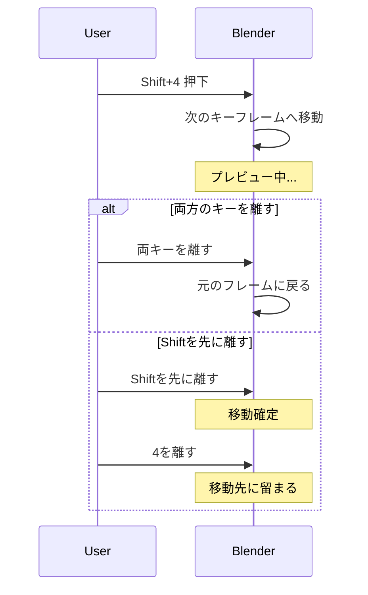

# Graph Monkey ユーザーガイド

Graph Monkeyは、BlenderのGraph Editorでのアニメーション作業を効率化するアドオンです。**キーボード操作だけで素早くキーフレームを編集**できるワークフローを提供します。

---

## 目次

- [クイックスタート](#クイックスタート)
- [WASD ナビゲーション](#wasd-ナビゲーション)
- [Channel Navigator](#channel-navigator)
- [フレーム移動と Peek](#フレーム移動と-peek)
- [Pieメニュー](#pieメニュー)
- [UI拡張機能](#ui拡張機能)
- [ポーズモード支援](#ポーズモード支援)
- [設定リファレンス](#設定リファレンス)

---

## クイックスタート

### キーボードレイアウト

| 色 | キー | 用途 |
|----|------|------|
| 🔴 赤 | `Alt + WASD/QE` | キーフレーム・チャンネル・ハンドル選択 |
| 🟠 橙 | `Y` 長押し | Channel Navigator |
| 🟢 緑 | `1234` | フレーム移動（どのエディタからでも使用可） |
| 🔵 青 | `F` | 選択カーブにフォーカス |
| 🟡 黄 | `Shift + T/C` | Pieメニュー |

**Shift を追加すると拡張選択**になります（選択に追加）。

### 最初に覚える3つの操作

1. **Alt + A/D** で左右のキーフレームへ移動
2. **Alt + W/S** で上下のチャンネルへ移動
3. **3/4** で前後のキーフレームへジャンプ（View3Dでも使える）

これだけでGraph Editorでの基本的なナビゲーションが完結します。

---

## WASD ナビゲーション

Graph Editorでのキーフレーム編集を高速化する中核機能です。

### 基本操作

**Alt + WASD** でキーフレーム間・チャンネル間を自由に移動します。

| キー | 動作 |
|------|------|
| `Alt + A` / `Alt + D` | 左右のキーフレームへ移動 |
| `Alt + W` / `Alt + S` | 上下のチャンネルへ移動 |
| `+ Shift` | 選択に追加（拡張選択） |

### ハンドル選択

キーフレームのベジェハンドル（制御点）を素早く選択します。

| キー | 動作 |
|------|------|
| `Alt + Q` / `Alt + E` | 左右のハンドルを選択 |
| `+ Shift` | 選択に追加 |

### Auto Focus

設定で「Auto Focus on Channel Change」を有効にすると、チャンネル移動時に選択カーブへ自動的にフォーカスします。

複数のチャンネルを比較する際に便利です。W/Sでチャンネルを切り替えながら、各カーブ全体を素早く確認できます。

**Auto Follow Current Frame** を有効にすると、A/Dでのキーフレーム移動時にも現在フレームが自動追従します（選択キーが1つの場合のみ）。

### フォーカス操作

| キー | 動作 |
|------|------|
| `F` | 再生範囲内で選択カーブにフォーカス |
| `Alt + F` | 選択カーブ全体を表示 |

---

## Channel Navigator

`Y`キーを**長押し**すると、インタラクティブなチャンネル管理ポップアップが表示されます。

### 操作方法

| 操作 | 動作 |
|------|------|
| マウスオーバー | チャンネル選択を切り替え |
| `Ctrl + クリック` | ソロ表示 |
| `H` / `L` / `M` | Hide / Lock / Mute トグル |
| マウスホイール | スクロール（8チャンネル以上で必要） |

Auto Focusが有効なら、チャンネルを切り替えると自動的にそのカーブにフォーカスします。

---

## フレーム移動と Peek

Timeline、Dopesheet、Graph Editor、**View3Dなどどのエディタからでも**使えるフレーム移動機能です。

### フレームジャンプ

| キー | 動作 |
|------|------|
| `1` / `2` | 1フレーム戻る / 進む |
| `3` / `4` | 前 / 次のキーフレームへジャンプ |

### キーフレームタイプフィルター

Timeline/Dopesheetヘッダーのフィルターで、**特定のキーフレームタイプのみをジャンプ対象**にできます。

KEYFRAME、BREAKDOWN、EXTREME等から選択可能。例えばKEYFRAMEとBREAKDOWNのみ選択すれば、他のタイプは`3`/`4`でスキップされます。

### Peek（先読み）

`Shift + 3/4` で隣のキーフレームを**一時的にプレビュー**します。**指パラと似た感覚**で前後のポーズを素早く確認できます。

**Peek中の操作**: `1`/`2`で追加オフセット、`Q`でリセット

---

## Pieメニュー

### キー整列 Pie（Shift + T）

Graph Editorでキーフレームを整列するPieメニューです。

| 項目 | 動作 |
|------|------|
| Left / Right | フレーム軸で整列（左端/右端） |
| Top / Bottom | 値軸で整列（最大値/最小値） |
| Flat | ハンドルを水平化（ウェイト付きにも対応） |

### Config Pie（Shift + C）

Graph Editorの設定を素早く変更するPieメニューです。

| 項目 | 動作 |
|------|------|
| Center / Individual / Cursor | Pivot Point切り替え |
| Proportional | プロポーショナル編集 + Falloff設定 |

---

## UI拡張機能

### Action ツールバー

Graph Editorのヘッダーに追加されるAction管理ボタン群です。通常Dopesheet Action Editorでしか見れない情報を、Graph Editorでも操作できるようにします。

| ボタン | 動作 |
|--------|------|
| Action Menu | Actionメニュー（4.4+） |
| 📋 Duplicate | 選択チャンネルを新Actionに移動（4.4+） |
| ⬇ Push Down | NLA Stackにプッシュダウン |
| ❄ Stash | NLA Stackにスタッシュ |

### 再生速度コントローラー

Dopesheet/Timelineヘッダーに追加される再生速度コントロールです。

スライダーで0.01x〜9.0xの速度調整、プリセットボタン（¼x/½x/1x/2x）でワンクリック設定。Storeボタンでオリジナル範囲を保存してから速度を変更してください。

### Channel Selection Overlay

選択中のF-Curve名をGraph Editor上に常時表示します。

### Sync Visible Range

複数のタイムベースエディタ間で表示範囲をロックします。

ヘッダー左端の🔒アイコンをクリック。ロック中は、あるエディタでスクロール/ズームすると他のエディタ（Dopesheet、Graph Editor、NLA等）も連動します。

### チャンネル展開/折りたたみ

| キー | 動作 |
|------|------|
| `Shift + A` | 全チャンネル展開 |
| `Ctrl + Shift + A` | 全チャンネル折りたたみ |

---

## ポーズモード支援

3D Viewのポーズ編集を支援する機能です。

### Pose Transform Visualizer

ボーンの回転量・移動量を3Dビュー上に視覚的に表示します。

円弧で回転量、矢印で移動量を可視化。カラースキームはHeat（変化が大きいほど赤）、Cool（青）、Grayscaleから選択可能。

### Bone Collection Solo

選択中のボーンが属するBone Collectionをソロ表示します（Blender 4.0+）。

| キー | 動作 |
|------|------|
| `/` | 選択ボーンのコレクションをソロ |
| `Alt + /` | ソロ解除 |

---

## 設定リファレンス

**Edit → Preferences → Add-ons → MonKey** で設定を変更できます。

### Graph Editor

| 項目 | デフォルト | 説明 |
|------|-----------|------|
| Auto Focus on Channel Change | ON | チャンネル移動後に自動フォーカス |
| Auto Follow Current Frame | OFF | キーフレーム選択時に現在フレーム追従 |

### Channel Navigator

| 項目 | デフォルト | 説明 |
|------|-----------|------|
| Box Height / Width | 28 / 280 | ポップアップサイズ |
| Text Size | 12 | テキストサイズ |
| Max Display Count | 8 | 最大表示チャンネル数 |

### Channel Overlay

| 項目 | デフォルト | 説明 |
|------|-----------|------|
| Font Size | 24 | フォントサイズ |
| Alignment | TOP_RIGHT | 表示位置（9箇所から選択） |

### Pose Visualizer

| 項目 | デフォルト | 説明 |
|------|-----------|------|
| Show Rotation / Location | ON / ON | 回転/移動可視化 |
| Color Scheme | Heat | Heat / Cool / Grayscale |

---

## トラブルシューティング

**キーバインドが動作しない**
- Preferences → Keymapで該当キーマップが有効か確認
- 他アドオンとの競合を確認
- 正しいエディタで操作しているか確認

**Channel Navigatorが表示されない**
- `Y`キーは**長押し**で動作します（タップではない）

**再生速度変更後にフレーム範囲がおかしい**
- Storeボタンでオリジナル範囲を保存してから速度を変更してください

---

*Graph Monkey - Graph Editorをもっと快適に*
